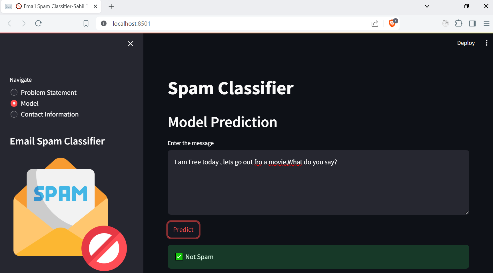

# 📧 Email Spam Classification Project

## Overview
This project focuses on building a machine learning model to classify emails as spam or not spam using natural language processing (NLP) techniques. The dataset used is the [SMS Spam Collection Dataset](https://www.kaggle.com/uciml/sms-spam-collection-dataset) from Kaggle, which contains 5572 SMS messages labeled as spam or ham (not spam).

## Motivation
Spam emails are a significant issue, causing inconvenience and security risks. This project aims to develop an effective spam classification model to help filter out unwanted messages, enhancing email security and user experience.

## Problem Statement
The goal is to classify emails as spam or ham using various NLP and machine learning techniques, focusing on achieving high precision to minimize false positives.

## Not Spam Email

## Success Metrics
The performance of the models is evaluated using the following metrics:
- **Accuracy**
- **Precision**

## Spam Email

Given the imbalanced nature of the dataset, precision is prioritized over accuracy.

## Methodology
1. **Data Cleaning** 🧹
   - Removed duplicates, handled missing values, and transformed the text data.

2. **Exploratory Data Analysis (EDA)** 📊
   - Analyzed the distribution of spam and ham emails.

3. **Text Preprocessing** ✍️
   - Converted text to lower case, removed stop words, and applied stemming.

4. **Vectorization** 🧮
   - Used Bag of Words (BoW) and Term Frequency-Inverse Document Frequency (TF-IDF) techniques for text vectorization.

5. **Model Building** 🛠️
   - Implemented various models including:
     - **Multinomial Naive Bayes**
     - **Bernoulli Naive Bayes**
     - **Gaussian Naive Bayes**

6. **Evaluation** 📈
   - Evaluated models based on accuracy, precision, 

7. **Improvement** 🔧
   - Tuned hyperparameters and tried different vectorization techniques to improve performance.

8. **Website** 🌐
   - Built a user-friendly web interface using Streamlit.

9. **Deployment** 🚀
   - Deployed the application on Streamlit Cloud.

## Best Model
The **Multinomial Naive Bayes** model performed best in terms of precision, making it the chosen model for this project. Despite BernoulliNB and GaussianNB showing better overall performance, the high precision of MultinomialNB makes it more suitable for our needs.

## Dataset
The raw dataset contained 5572 rows and 5 columns. After data cleaning and EDA, the focus was on two columns:
- **target**: The label indicating if the message is spam or ham.
- **transformed_text**: The cleaned and preprocessed text of the message.

## Requirements
The following libraries were used in this project:
- Streamlit
- NLTK
- Pandas
- Numpy
- Scikit-learn
- Wordcloud

## Steps Followed
1. **Data Cleaning** 🧹
2. **EDA** 📊
3. **Text Preprocessing** ✍️
4. **Model Building** 🛠️
5. **Evaluation** 📈
6. **Improvement** 🔧
7. **Website** 🌐
8. **Deployment** 🚀

## Conclusion
This project successfully built an email spam classifier with high precision using the Multinomial Naive Bayes model. The application is deployed and accessible through a user-friendly Streamlit interface.
